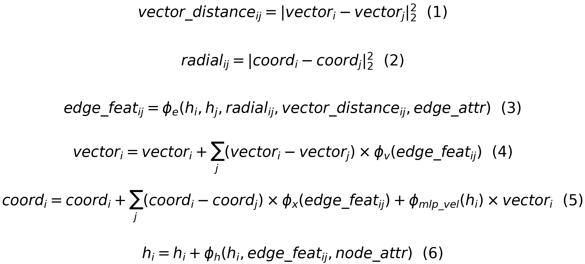
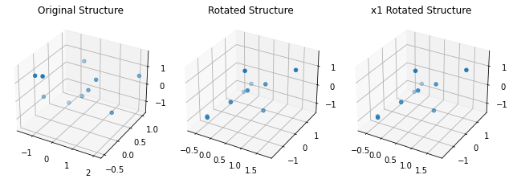
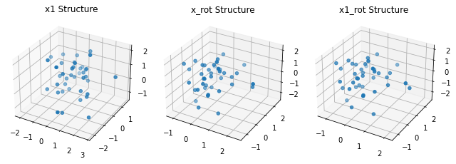
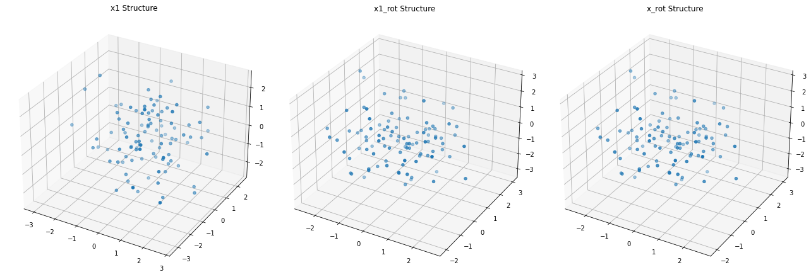
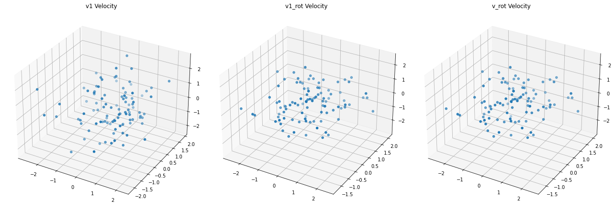
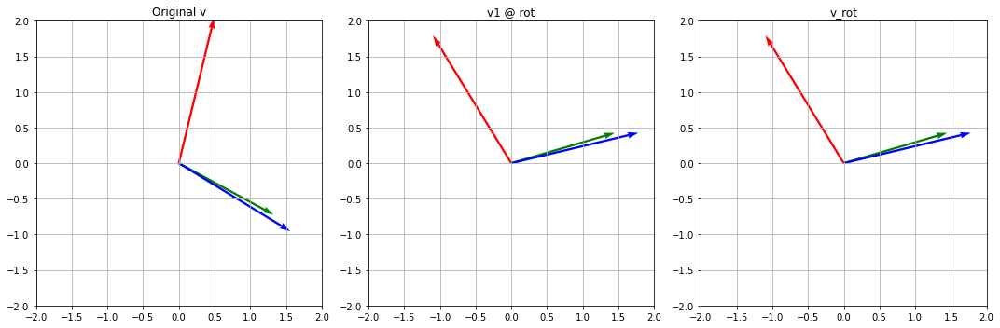
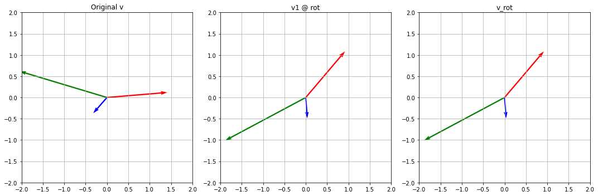
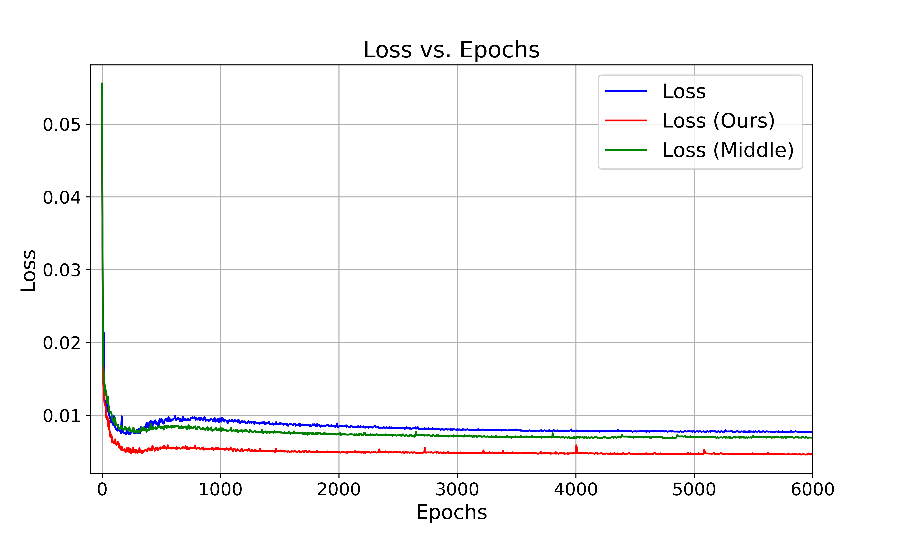

# Equivariant_Graph_Operator


At present, the improved algorithm and experimental verification process are recorded.


## 1.Improved mathematical formula

### 1.1.Model Equations:



### 1.2.Formulas Explanation


1. **Distance between Vectors**:
   - **Meaning**: This represents the Euclidean distance of vector differences between node i and node j. It might denote the velocity or other types of vector differences between two entities, such as two nodes or objects.

2. **Distance between Coordinates**:
   - **Meaning**: This is the Euclidean distance of coordinate differences between node i and node j. It measures the physical or spatial distance between two nodes in a given coordinate space.

3. **Edge Feature Update**:
   - **Meaning**: This formula describes how to update the features of an edge based on the characteristics of two nodes, their spatial distance, vector distance, and the edge attributes. Here, \(\phi_e\) is a function, which could be a neural network or another mapping, used to compute the new features of the edge.

4. **Vector Update**:
   - **Meaning**: This formula describes how to update the vector of node i based on its vector differences with all other nodes j and the edge features. This might represent a form of vector accumulation, where each j imposes a vector on i determined by \(\phi_v\).

5. **Coordinate Update**:
   - **Meaning**: This formula outlines how to update the coordinates of node i. It considers the coordinate differences of i with all other nodes j, the features of the edge, and the velocity determined by \(\phi_{mlp\_vel}\) and the current vector.

6. **Node Feature Update**:
   - **Meaning**: This formula illustrates how to update the features of node i. It does so based on the current node features, the features of the edge related to node i, and the attributes of the node.


## 2.Equivariant verification experiments

### 2.1.Verify that the position x is equivariant？

When the input features h and position x, we test their equivariance, and we can see that EGNN maintains equivariance, our EGNO follows its core architecture and provides the idea of multi-scale, which also maintains equivariance, the code for equivariance validation is shown in *EGNO_equveri_hx.ipynb*, and the results of the equivariance validation visualization are as follows:


```python
from e3nn import o3
import torch
from torch import nn
import torch.nn.functional as F

rot = o3.rand_matrix()
batch_size = 1
n_nodes = 10
n_feat = 3
x_dim = 3

h = torch.randn(batch_size *  n_nodes, n_feat)
x = torch.randn(batch_size * n_nodes, x_dim)
edges, edge_attr = get_edges_batch(n_nodes, batch_size)

egnn = EGNN(in_node_nf=n_feat, hidden_nf=32, out_node_nf=3, in_edge_nf=1)
h1, x1 = egnn(h, x, edges, edge_attr)

h_rot, x_rot = egnn(h, x @ rot, edges, edge_attr)

h1_rot = h1 @ rot
x1_rot = x1 @ rot

print("h1\n", h1)
print("h1 @ rot\n", h1_rot)
print("h_rot\n", h_rot)

print("x1\n", x1)
print("x1 @ rot\n", x1_rot)
print("x_rot\n", x_rot)

print("Are h1 @ rot and h_rot close?", torch.allclose(h1_rot, h_rot, atol=1e-6))
print("Are x1 @ rot and x_rot close?", torch.allclose(x1_rot, x_rot, atol=1e-6))
```



### 2.2.Verify that position x, vector v are equivariant？

#### 2.2.1 EGNN.

Compared to Section 2.1, this architecture has more vector features v, which can be velocity or other vectors, etc. First, we verify the equivariant of EGNN and find that it is not equivariant, the test code and visualization results are as follows:

```python
from e3nn import o3
import torch
from torch import nn
import torch.nn.functional as F
rot = o3.rand_matrix()

batch_size = 1
n_nodes = 4
n_feat = 1
x_dim = 3
h = torch.randn(batch_size *  n_nodes, n_feat)
x = torch.randn(batch_size * n_nodes, x_dim)
vel = torch.ones(batch_size * n_nodes, x_dim)

edges, edge_attr = get_edges_batch(n_nodes, batch_size)

egnn = EGNN_vel(in_node_nf=n_feat, in_edge_nf = 1, hidden_nf=32)

x1 = egnn(h, x, edges, vel, edge_attr)


x_rot = egnn(h, x @ rot, edges, vel, edge_attr)
x1_rot = x1 @ rot

print("x1\n", x1)
print("x1 @ rot\n", x1_rot)
print("x_rot\n", x_rot)

print("Are x1 @ rot and x_rot close?", torch.allclose(x1_rot, x_rot, atol=1e-20))
```
Output as follows:
```python
x1
 tensor([[ 1.1342,  1.5362,  2.6083],
        [ 0.0199, -0.3089,  2.3126],
        [-0.8676,  0.7925,  0.5705],
        [ 0.3860,  0.6144,  3.9114]], grad_fn=<AddBackward0>)
x1 @ rot
 tensor([[-3.0461,  0.5190,  0.9494],
        [-2.0205, -1.1664,  0.0324],
        [-0.7875,  0.4312, -0.9488],
        [-3.8654, -0.8952,  0.2889]], grad_fn=<MmBackward0>)
x_rot
 tensor([[-2.4514,  0.6131,  0.9788],
        [-1.4191, -1.0712,  0.0622],
        [-0.2030,  0.5236, -0.9199],
        [-3.1919, -0.7885,  0.3225]], grad_fn=<AddBackward0>)
Are x1 @ rot and x_rot close? False
```
The feature map is visualized as follows:




#### 2.2.2 Ours Model -- EGNO

Consistent with the above verification, we perform isovariance verification, but the exciting result is that we are fully equivariant, and furthermore, in contrast to EGNN, which is unable to update the velocity, we can perform velocity updates, and thus we verify not only the isovariance of the position, but also that of the velocity, Some detials as follows:

```python
from e3nn import o3
import torch
from torch import nn
import torch.nn.functional as F


rot = o3.rand_matrix()


batch_size = 1
n_nodes = 3
n_feat = 3
x_dim = 3
v_dim = 3
h = torch.randn(batch_size *  n_nodes, n_feat)
x = torch.randn(batch_size * n_nodes, x_dim)
v = torch.randn(batch_size * n_nodes, v_dim)
edges, edge_attr = get_edges_batch(n_nodes, batch_size)

EGO = Equivariant_Graph_Operator(3, 3, 32)

h1, x1, v1 = EGO(h, edges, x, v)
print(h1.shape, x1.shape, v1.shape)
h_rot, x_rot, v_rot = EGO(h, edges, x @ rot, v@ rot)

h1_rot = h1 @ rot
x1_rot = x1 @ rot
v1_rot = v1 @ rot


print("h1\n", h1)
print("h1 @ rot\n", h1_rot)
print("h_rot\n", h_rot)

print("x1\n", x1)
print("x1 @ rot\n", x1_rot)
print("x_rot\n", x_rot)

print("v1\n", v1)
print("v1 @ rot\n", v1_rot)
print("v_rot\n", v_rot)

print("Are h1 @ rot and h_rot close?", torch.allclose(h1_rot, h_rot, atol=1e-20))
print("Are x1 @ rot and x_rot close?", torch.allclose(x1_rot, x_rot, atol=1e-20))
print("Are v1 @ rot and v_rot close?", torch.allclose(v1_rot, v_rot, atol=1e-20))
```
Output as follows:
```python
torch.Size([3, 3]) torch.Size([3, 3]) torch.Size([3, 3])
h1
 tensor([[0.0000, 0.0000, 0.1249],
        [0.0000, 0.0000, 0.1168],
        [0.0000, 0.0000, 0.1035]], grad_fn=<ReluBackward0>)
h1 @ rot
 tensor([[ 0.0275, -0.0957,  0.0754],
        [ 0.0257, -0.0895,  0.0706],
        [ 0.0228, -0.0793,  0.0625]], grad_fn=<MmBackward0>)
h_rot
 tensor([[0.0000, 0.0000, 0.1249],
        [0.0000, 0.0000, 0.1168],
        [0.0000, 0.0000, 0.1035]], grad_fn=<ReluBackward0>)
x1
 tensor([[ 0.4185,  0.5561, -0.5476],
        [-0.7948,  1.3824, -0.4261],
        [ 0.4186,  0.8139, -0.3223]], grad_fn=<AddBackward0>)
x1 @ rot
 tensor([[-0.7991,  0.3110, -0.2212],
        [-0.7437, -0.6858, -1.3042],
        [-0.9546,  0.0097, -0.1737]], grad_fn=<MmBackward0>)
x_rot
 tensor([[-0.7991,  0.3110, -0.2212],
        [-0.7437, -0.6858, -1.3042],
        [-0.9546,  0.0097, -0.1737]], grad_fn=<AddBackward0>)
v1
 tensor([[ 0.9260,  0.9021, -1.6374],
        [ 1.4491,  0.3346, -0.1303],
        [-0.4343,  1.9641, -0.3251]], grad_fn=<AddBackward0>)
v1 @ rot
 tensor([[-1.6008,  1.1783, -0.6337],
        [-1.1137,  0.5191,  0.8479],
        [-1.3876, -0.9079, -1.1841]], grad_fn=<MmBackward0>)
v_rot
 tensor([[-1.6008,  1.1783, -0.6337],
        [-1.1137,  0.5191,  0.8479],
        [-1.3876, -0.9079, -1.1841]], grad_fn=<AddBackward0>)
Are h1 @ rot and h_rot close? False
Are x1 @ rot and x_rot close? True
Are v1 @ rot and v_rot close? True
```

The feature map is visualized as follows:





### 2.3.Verify that velocities in the flow field case are equivariant (O2)？

The flow field, unlike the molecule, is 2D, and the inputs usually contain position and vector (e.g., velocity) as well as pressure, etc., and we focus on verifying that its velocities remain equivariant, using O2 rotations, as detailed below:


```python
from e3nn import o3
import torch
from torch import nn
import torch.nn.functional as F
import math

rot = o3.rand_matrix()


angle = math.radians(45)  # 将角度转换为弧度

rotation_matrix = torch.tensor([
    [math.cos(angle), -math.sin(angle)],
    [math.sin(angle), math.cos(angle)]
])

batch_size = 1
n_nodes = 3
n_feat = 3
v_dim = 2
h = torch.randn(batch_size *  n_nodes, n_feat)
v = torch.randn(batch_size * n_nodes, v_dim)


print(h.shape, v.shape)
edges, edge_attr = get_edges_batch(n_nodes, batch_size)

print("edges shape, edge_attr.shape", len(edges), edge_attr.shape)


egnn = EGNN(in_node_nf=n_feat, hidden_nf=32, out_node_nf=3, in_edge_nf=1)
h1, v1 = egnn(h, v, edges, edge_attr)

v_rot_tensor =  torch.mm(v, rotation_matrix.T) 

h_rot, v_rot = egnn(h, v_rot_tensor, edges, edge_attr)

h1_rot = h1 @ rot
v1_rot = v_rot_tensor =  torch.mm(v1, rotation_matrix.T)  

print("h1\n", h1)
print("h1 @ rot\n", h1_rot)
print("h_rot\n", h_rot)

print("v1\n", v1)
print("v1 @ rot\n", v1_rot)
print("v_rot\n", v_rot)

print("Are h1 @ rot and h_rot close?", torch.allclose(h1_rot, h_rot, atol=1e-6))
print("Are v1 @ rot and v_rot close?", torch.allclose(v1_rot, v_rot, atol=1e-6))
```

Output as follows:
```python
h1
 tensor([[ 0.7262, -0.1118,  0.1525],
        [ 0.8830, -0.2530, -0.2216],
        [ 0.9893, -0.5261,  0.2272]], grad_fn=<AddmmBackward0>)
h1 @ rot
 tensor([[ 0.6696,  0.3035, -0.1504],
        [ 0.9154, -0.0394, -0.2310],
        [ 1.0882,  0.3315,  0.1152]], grad_fn=<MmBackward0>)
h_rot
 tensor([[ 0.7262, -0.1118,  0.1525],
        [ 0.8830, -0.2530, -0.2216],
        [ 0.9893, -0.5261,  0.2272]], grad_fn=<AddmmBackward0>)
v1
 tensor([[ 0.4923,  2.0411],
        [ 1.3240, -0.7226],
        [ 1.5588, -0.9558]], grad_fn=<AddBackward0>)
v1 @ rot
 tensor([[-1.0952,  1.7914],
        [ 1.4472,  0.4252],
        [ 1.7780,  0.4264]], grad_fn=<MmBackward0>)
v_rot
 tensor([[-1.0952,  1.7914],
        [ 1.4472,  0.4252],
        [ 1.7780,  0.4264]], grad_fn=<AddBackward0>)
Are h1 @ rot and h_rot close? False
Are v1 @ rot and v_rot close? True
```

The feature map is visualized as follows:




### 2.4.Verification of EGNN-Unet for equivariant properties

We have incorporated the idea of U-Net architecture with the aim of capturing long range information and the forward propagation code is as follows：


```python
class EGNN_UNet(nn.Module):
    def __init__(self, in_node_nf, hidden_nf, out_node_nf, in_edge_nf=0, device='cpu', act_fn=nn.SiLU(), n_layers=8, residual=True, attention=False, normalize=False, tanh=False):
        super(EGNN_UNet, self).__init__()
        self.hidden_nf = hidden_nf
        self.device = device
        self.n_layers = n_layers // 2  
        self.embedding_in = nn.Linear(in_node_nf, self.hidden_nf)
        self.embedding_out = nn.Linear(self.hidden_nf, out_node_nf)
  
        for i in range(0, self.n_layers):
            self.add_module("encoder_%d" % i, E_GCL(self.hidden_nf, self.hidden_nf, self.hidden_nf, edges_in_d=in_edge_nf,
                                                    act_fn=act_fn, residual=residual, attention=attention,
    
        for i in range(0, self.n_layers):
            self.add_module("decoder_%d" % i, E_GCL(self.hidden_nf, self.hidden_nf, self.hidden_nf, edges_in_d=in_edge_nf,
                                                    act_fn=act_fn, residual=residual, attention=attention,
                                                    normalize=normalize, tanh=tanh))
        
        self.to(self.device)

    def forward(self, h, x, edges, edge_attr):
        h = self.embedding_in(h)
        skip_connections = []
        
  
        for i in range(0, self.n_layers):
            h, x, _ = self._modules["encoder_%d" % i](h, edges, x, edge_attr=edge_attr)
            skip_connections.append(h)
        
   
        for i in range(0, self.n_layers):
            # skip
            h = h + skip_connections[-(i+1)]
            h, x, _ = self._modules["decoder_%d" % i](h, edges, x, edge_attr=edge_attr)
        
        h = self.embedding_out(h)
        
        return h, x
```
Next, we verify that it is equivariant, and the verification code is as follows:
```python
from e3nn import o3
import torch
from torch import nn
import torch.nn.functional as F
import math

batch_size = 1
n_nodes = 3
n_feat = 3
v_dim = 2


h = torch.randn(batch_size * n_nodes, n_feat)
v = torch.randn(batch_size * n_nodes, v_dim)

print('Input Shape:',h.shape, v.shape)


edges = torch.tensor([[i, j] for i in range(n_nodes) for j in range(n_nodes) if i != j]).t().contiguous()
edge_attr_dim = 4
edge_attr = torch.randn(edges.shape[1], edge_attr_dim)


model = EGNN_UNet(in_node_nf=n_feat, hidden_nf=5, out_node_nf=3, in_edge_nf=edge_attr_dim)
output_h, output_v = model(h, v, edges, edge_attr)

print('Output Shape:',output_h.shape, output_v.shape)  # [batch_size * n_nodes, out_node_nf]


v_rot_tensor =  torch.mm(v, rotation_matrix.T)  
h_rot, v_rot = model(h, v_rot_tensor, edges, edge_attr)


h1_rot = output_h @ rot
v1_rot  =  torch.mm(output_v, rotation_matrix.T) 


print("h1\n", h1)
print("h1 @ rot\n", h1_rot)
print("h_rot\n", h_rot)

print("v1\n", v1)
print("v1 @ rot\n", v1_rot)
print("v_rot\n", v_rot)

print("Are h1 @ rot and h_rot close?", torch.allclose(h1_rot, h_rot, atol=1e-6))
print("Are v1 @ rot and v_rot close?", torch.allclose(v1_rot, v_rot, atol=1e-6))
```
Output as follows:

```python
h1
 tensor([[ 0.1421,  0.0695, -0.3321],
        [-0.0890, -0.2074,  0.3731],
        [ 0.6919,  0.3627, -0.1294]], grad_fn=<AddmmBackward0>)
h1 @ rot
 tensor([[-1.3303,  1.7022, -0.9560],
        [-1.0872, -0.6114, -0.8138],
        [-3.1276,  0.1176, -0.0393]], grad_fn=<MmBackward0>)
h_rot
 tensor([[ 2.0235, -1.1660,  0.3563],
        [-0.0746, -0.7523,  1.2832],
        [ 0.2963, -2.9879,  0.8843]], grad_fn=<AddmmBackward0>)
v1
 tensor([[-0.1054,  0.1197],
        [ 0.6035, -0.4583],
        [ 0.8969, -0.6002]], grad_fn=<AddBackward0>)
v1 @ rot
 tensor([[ 0.9174,  1.0849],
        [-1.8859, -1.0115],
        [ 0.0352, -0.4894]], grad_fn=<MmBackward0>)
v_rot
 tensor([[ 0.9174,  1.0849],
        [-1.8859, -1.0115],
        [ 0.0352, -0.4894]], grad_fn=<AddBackward0>)
Are h1 @ rot and h_rot close? False
Are v1 @ rot and v_rot close? True
```

The feature map is visualized as follows:



## 3.Experiments 

### 3.1.N-Body System Initial Experimental Results

We conducted comparison experiments with the same settings, as shown in the figure, the MSE error for half dataset is reduced by about 10.44
percent, and the MSE error is reduced by about 38.26 percent for the full dataset.



